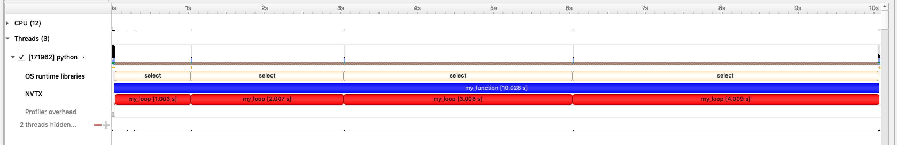

# nvtx Python package

## Installation

```
pip install nvtx
```

## Quick start

1. Annotate the parts of your Python code that you wish to profile/analyse:
   
   ```python
   # demo.py

   import time
   import nvtx

   @nvtx.annotate(color="blue")
   def my_function():
       for i in range(5):
           with nvtx.annotate("my_loop", color="red"):
               time.sleep(i)

   my_function()
   ```

2. Use [Nsight systems](https://developer.nvidia.com/nsight-systems) to
   collect profile data:

   ```
   nsight-sys profile -t nvtx python demo.py
   ```
   
3. Visualize the results using the Nsight systems GUI:

   

## Documentation

See [here](https://github.com/NVIDIA/NVTX/blob/dev/python/docs/basic.rst) for
detailed docs.
