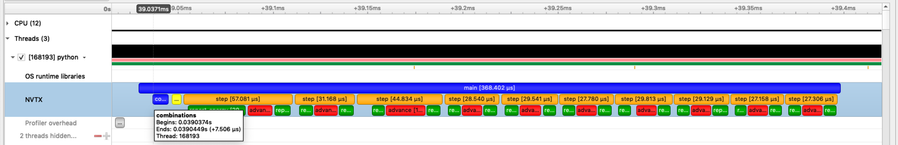

# nvtx Python package

## Installation

Install using conda:
```
conda install -c conda-forge nvtx
```

...or using pip:
```
python -m pip install nvtx
```

## Quick start

1. Annotate the parts of your Python code you wish to profile/analyze:
   
   ```python
   # demo.py

   import time
   import nvtx

   @nvtx.annotate(color="blue")
   def my_function():
       for i in range(5):
           with nvtx.annotate("my_loop", color="red"):
               time.sleep(i)

   my_function()
   ```

2. Use [NVIDIA Nsight Systems](https://developer.nvidia.com/nsight-systems) to
   collect profile data:

   ```
   nsys profile -t nvtx python demo.py
   ```
   
3. Visualize the results using the Nsight systems GUI:

   

## Documentation

See [here](docs/index.rst) for detailed docs.
