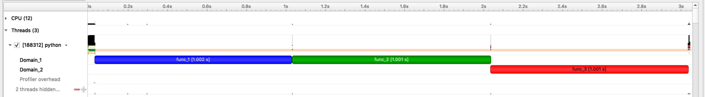

Tools for annotating code
=========================

annotate
--------

The ``annotate()`` function annotates a code range, i.e., one or more statements.
Each code range may have a message and a color associated with it.
This makes it easy to distinguish ranges when visualizing them.
``annotate`` can be used in two ways:

As a decorator:
::

   @nvtx.annotate(message="my_message", color="blue")
   def my_func():
       pass

As a context manager:
::

   with nvtx.annotate(message="my_message", color="green"):
       pass

When used as a decorator, the ``message`` argument defaults to the
name of the function being decorated:
::

   @nvtx.annotate()  # message defaults to "my_func"
   def my_func():
       pass

start_range and end_range
-------------------------

In certain situations, it is impossible to use ``annotate()``,
e.g., when a code range spans multiple functions or in asynchronous code.
In such cases, the ``start_range()`` and ``end_range()`` functions
can be used instead.

The ``start_range()`` function is called at the beginning of a code range,
and returns a handle. The handle is passed to the ``end_range()`` function,
which is called at the end of the code range.

::

   rng = nvtx.start_range(message="my_message", color="blue")
   # ... do something ... #
   nvtx.end_range(rng)

mark
----

The ``mark()`` function marks an instantaneous event in the execution of a program.
For example, you may want to mark when an exceptional event occurs:
::

   try:
       something()
   except SomeError():
       nvtx.mark(message="some error occurred", color="red")
       # ... do something else ...

Domains
-------

In addition to a message and a color,
annotations can also have a `domain` associated with them.
This allows grouping annotations.
::

   import time
   import nvtx

   @nvtx.annotate(color="blue", domain="Domain_1")
   def func_1():
       time.sleep(1)

   @nvtx.annotate(color="green", domain="Domain_2")
   def func_2():
       time.sleep(1)

   @nvtx.annotate(color="red", domain="Domain_1")
   def func_3():
       time.sleep(1)

   func_1()
   func_2()
   func_3()

The timeline generated from the above:

Domains should be used sparingly as they are expensive to create.
It is typically recommended to use a single domain per library.
For grouping of annotations within a library,
e.g., distinguishing annotations relating to compute, memory and I/O,
use `Categories`_ instead.

Categories
----------

Categories allow grouping of annotations within a domain.
::

   import time
   import nvtx

   @nvtx.annotate(color="blue", domain="Domain_1", category="Cat_1")
   def func_1():
       time.sleep(1)

   @nvtx.annotate(color="green", domain="Domain_1", category="Cat_2")
   def func_2():
       time.sleep(1)

   @nvtx.annotate(color="red", domain="Domain_2", category="Cat_1")
   def func_3():
       time.sleep(1)

   @nvtx.annotate(color="red", domain="Domain_2", category=2)
   def func_4():
       time.sleep(1)

   func_1()
   func_2()
   func_3()
   func_4()

In the example above, `func_1` and `func_2`
are grouped under the domain `Domain1`,
but under different categories within that domain.

Although `func_1` and `func_3` are both grouped
under a category named `Cat_1`, they are unrelated
as each domain maintains its own categories.

Unlike domains, categories are not expensive to create and manage.
Thus, you should prefer categories for maintaining several groups
of annotations.
