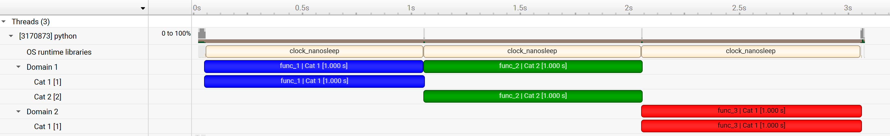
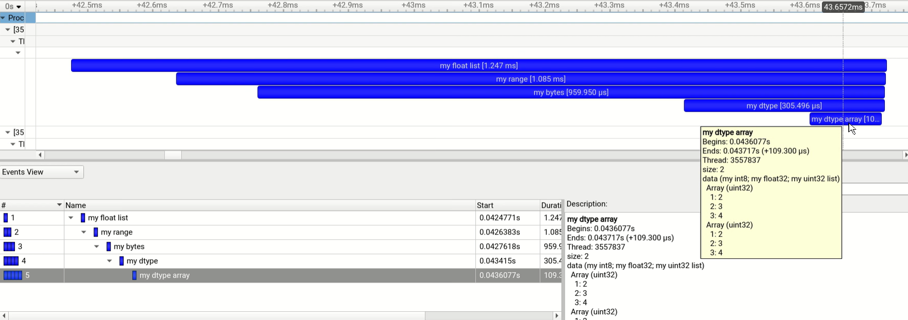

.. SPDX-FileCopyrightText: Copyright (c) 2025-2026 NVIDIA CORPORATION & AFFILIATES. All rights reserved.
.. SPDX-License-Identifier: Apache-2.0 WITH LLVM-exception

Annotation Attributes
======================

- Message

  - Associate an annotation with a message, e.g., the function name when decorating a function.

- Color

  - The color attribute can be used to guide the tool's visualization of annotations.

- Domain

  - Domains enable scoping of annotations. Each domain maintains its own categories,
    range stacks and registered strings.

  - By default, all annotations are in the default domain.
    Additional domains with distinct names can be registered by using :func:`nvtx.get_domain`.

  - It is recommended to use a single (non-default) domain per library.

- Category

  - Categories can be used to group annotations within a domain.

- Payload

  - Additional data associated with the annotation.

  - Parmeters or metadata are recommended to be added as payloads,
    rather than embedding them into the message string.

  - Payloads provide a separation between the message and the data of the event,
    which is often useful for analysis.

  - In the Nsight Systems GUI,
    payloads are displayed in the tooltip of the event and in the event view.

  - **Supported Types:**

    - **int**: 64-bit signed integer
    - **float**: 64-bit floating point
    - **numpy.ndarray**: NumPy arrays (requires NumPy)

      - Including `Structured arrays <https://numpy.org/doc/stable/user/basics.rec.html#structured-arrays>`_.
    - **list, tuple, range**: Converted to NumPy arrays (requires NumPy)
    - **bytes**: Byte sequences (requires NumPy)

**Example:**

::

   import time
   import nvtx

   @nvtx.annotate(color="blue", domain="Domain 1", category="Cat 1")
   def func_1():
       time.sleep(1)

   @nvtx.annotate(color="green", domain="Domain 1", category="Cat 2")
   def func_2():
       time.sleep(1)

   @nvtx.annotate(color="red", domain="Domain 2", category="Cat 1")
   def func_3():
       time.sleep(1)

   func_1()
   func_2()
   func_3()

Profiling the above code with Nsight Systems will produce the following timeline:

|

**Extended Payload Example:**

::

  import nvtx
  import numpy as np

  # Examples with builtin Python iterable objects.
  nvtx.push_range(message='my float list', payload=[1, 2.5, 3.5, 4.5])
  nvtx.push_range(message='my range', payload=range(10))
  nvtx.push_range(message='my bytes', payload=b'\xde\xad\xbe\xef')

  # Example with structured datatype.
  # Payload is passed as a NumPy array.
  my_dtype = np.dtype([
      ('my int8', np.int8),
      ('my float32', np.float32),
      ('my uint32 list', np.uint32, 4)
  ])

  nvtx.push_range(message='my dtype', payload=np.array((10, 20.5, [1,2,3,4]), dtype=my_dtype))
  nvtx.push_range(message='my dtype array',
                  payload=np.array([(10, 20.5, [1,2,3,4]),(30, 40.5, [1,2,3,4])], dtype=my_dtype))

  # Pop all pushed ranges.
  for _ in range(5):
      nvtx.pop_range()

Profiling the above code with Nsight Systems will produce the following timeline:

