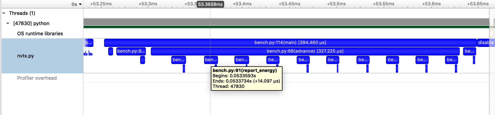

Automatic function annotation
=============================

Annotating code manually is not always desirable, for example,
when you have lots of functions to annotate,
or when you want to capture information from third-party libraries.

``nvtx``  can automatically annotate each function call in your program.
Note that doing this adds a tiny amount of
overhead to each and every function invocation, which can significantly
impact the overall runtime (by more than 10x).

This can give you lots of useful information that manual
annotation cannot

Command-line interface
----------------------

You can invoke ``nvtx`` as a command-line script, which annotates every function call,
with no changes to the source code:

::

   python -m nvtx script.py

The Profile class
-----------------

You can also use ``Profile`` to enable and disable
automatic function annotation in different parts of
your program:

::

   pr = nvtx.Profile()
   pr.enable()  # begin annotating function calls
   # -- do something -- #
   pr.disable()  # stop annotating function calls
