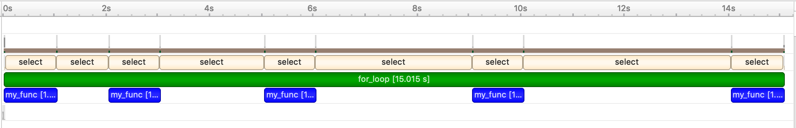

.. nvtx documentation master file, created by
   sphinx-quickstart on Wed May  6 16:27:08 2020.
   You can adapt this file completely to your liking, but it should at least
   contain the root `toctree` directive.

================================================
nvtx - Annotate code ranges and events in Python
================================================

``nvtx`` gives your tools to annotate your Python code
(or automatically annotates it for you).
Annotated code can be analyzed and visualized by third-party applications such as
`NVIDIA Nsight Systems <https://developer.nvidia.com/nsight-systems>`_.
For example, you can produce detailed timelines of execution
of Python programs annotated with ``nvtx``:

.. image:: images/timeline.png
    :align: center

Quick Demo
==========

Here is an example of using the annotation tools provided  by ``nvtx``:

::

   # example_lib.py

   import time
   import nvtx

   def sleep_for(i):
       time.sleep(i)

   @nvtx.annotate()
   def my_func():
       time.sleep(1)

   with nvtx.annotate("for_loop", color="green"):
       for i in range(5):
           sleep_for(i)
           my_func()

Adding annotations to your code doesn't achieve anything by itself.
To derive something useful from annotated code,
you'll need to use a third-party application that supports NVTX annotations.
The command below uses the Nsight Systems command-line interface to collect
information from the annotated code:

::

   nsys profile python demo.py

This produces an ``.nsys-rep`` file containing information about the annotated code.
Opening that file in the Nsight Systems GUI,
you can see a timeline of execution of your program:

           
Contents
========

.. include:: toctree.rst

Indices and tables
==================

* :ref:`genindex`
* :ref:`modindex`
* :ref:`search`
